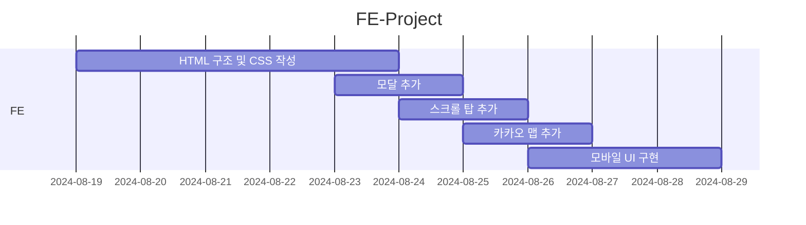

# ESTsoft 부트캠프 프론트엔드 프로젝트

## 1. 목표와 기능

### 1.1 목표
- 피그마 링크와 요구사항 명세 참고하여 작성
- 모바일 화면 구현
- 카카오 맵 api 사용

### 1.2 기능
- 스크롤 시 헤더 상단에 고정
- 카카오 맵은 마커, 확대/축소 및 지도/스카이뷰 전환 기능
- 스크롤 탑 버튼으로 상단까지 부드럽게 이동
- 이메일 입력을 통해 Subscribe 버튼 동작
- Subscribe 버튼은 이메일 유효성 검사 통과 시 모달 창 열림 & 실패 시 경고창 출력
- 모달창은 OK 버튼과 모달 외부 클릭 시 닫힘

## 2. 개발 환경 및 배포 URL

### 2.1 개발 환경
- Web Framework
  - Vanilla HTML and CSS JavaScript
- IDE
  - VS Code
- 서비스 배포 환경
  - Github Pages

### 2.2 배포 URL
- Github Repository : https://github.com/kkwggwp/kkwggwp.github.io
- Github Pages : https://kkwggwp.github.io/

## 3. 요구사항 명세
1. 피그마를 참고하여 페이지 구현을 합니다.
2. 모바일 화면도 고려하여 페이지 구현을 합니다.
3. 스크롤시 헤더가 고정되게 합니다. (단, 처음에는 고정된 상태가 아닙니다.)
4. 스크롤 탑 버튼을 구현합니다.
  - 스크롤 탑 버튼은 스크롤시 나타납니다.
  - 스크롤 탑 버튼은 푸터 아래로 내려가지 않습니다.
  - 스크롤 탑 버튼을 누르면 스크롤이 최상단으로 올라갑니다. (단, 부드럽게 올라가야 합니다.)
6. 구독하기 모달창
  - 이메일을 입력하고 `Subscribe` 버튼을 클릭하면 모달창이 나타납니다.
  - 이메일 유효성 검사를 진행해야 합니다. (값이 들어가지 않거나 이메일 형식이 유효하지 않으면 alert 창으로 경고 문구가 떠야합니다.)
  - 이메일이 잘 입력되었다면 모달창이 뜹니다. 이때 모달창의 `OK! I love HODU` 버튼을 클릭하면 form이 제출되고 모달창이 닫힙니다.

## 4. 프로젝트 구조와 개발 일정
### 4.1 프로젝트 구조
📦root
 ┣ 📂img  
 ┣ 📜index.html  
 ┣ 📜style.css  
 ┣ 📜reset.css  
 ┣ 📜script.js  

### 4.2 개발 일정

## 5. UI

## 6. 에러와 에러 해결

## 7. 개발하며 느낀점
- 반응형 레이아웃은 처음부터 염두에 둬야한다
  - 모바일 레이아웃만 남긴 상태에서 구현하려고 하니 막히는게 한 두가지가 아니었다 이거 저거 뜯어 고치면서 만져 봤으나 만족스러운 결과는 나오지 않았다 결국 모바일 레이아웃 구현까지 마치지 못해서 속상했다
